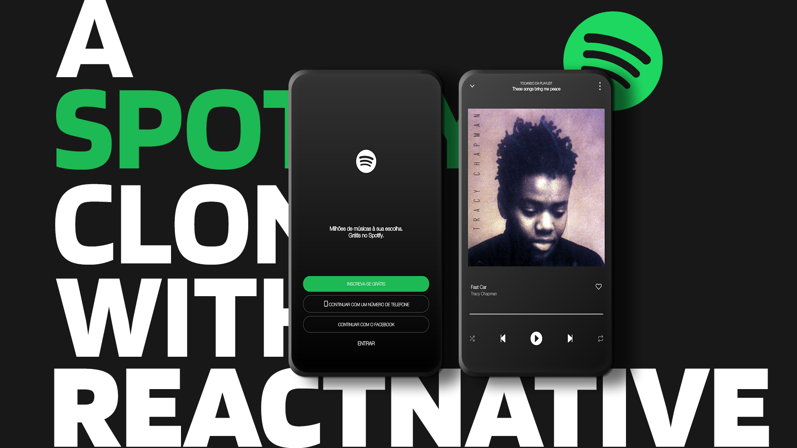

<h1  align="center">

</h1>

<p  align="center">

</p>

<h4  align="center">
	⚡ Clone Spotify App
</h4>

<p  align="center">
<a  href="#projeto">🔭 Projeto</a>&nbsp;&nbsp;&nbsp;|&nbsp;&nbsp;&nbsp
<a  href="#-getting-started">🤠 Getting Started </a>
</p>

## Projeto

Este projeto foi realizado para aperfeiçoamento das habilidades de construção de interface utilizando o react native, consiste em clonar duas telas de um App. Desenvolvido durante a Residência de software, do SerraTec, dado como uma avaliação individual da displina de React Native. 

## Getting Started 

Para instalar, clone o git e instale todas as dependências. 

```
npm i 
ou 
yarn install
```

Após instalar todas as dependências, inicie a aplicação com o comando. 

```
react-native run-android 
ou 
npx react-native run-android
```
